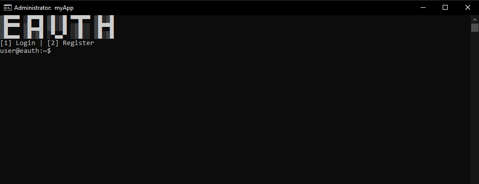

What is Eauth?
==============

https://eauth.us.to/ - Your #1 Free and Powerful Software Authentication Solution, Ultimately providing you with the most secure features and easy to use on an authentication system.    
  
Documentation
-------------

https://eauth.us.to/docs/


Configuration
-------------

Navigate to `eauth/eauth.go`, and fill these lines of code:

```go
// Required configuration
const accountKey string = ""            /* Your account key goes here */
const applicationKey string = ""        /* Your application key goes here */
const applicationID string = ""         /* Your application ID goes here */
const applicationVersion string = "1.0" /* Your application version goes here */
```
